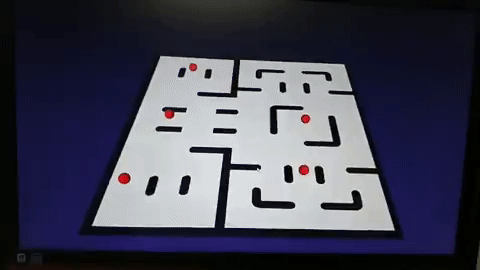

# Pac Bot

## Pac bot playing area on Rviz and Printed for realworld

## Movement of bots on real world being presented in virtual world

Interaction b/w real World and virtual World to play classic pac man game. This game is based on ROS and Ardunio.

ROS is using RViz to make virtual world.

Bot are contorlled using simple serial Communication.

Auto-Bots or ghost are controlled navigating using simple LFR.

